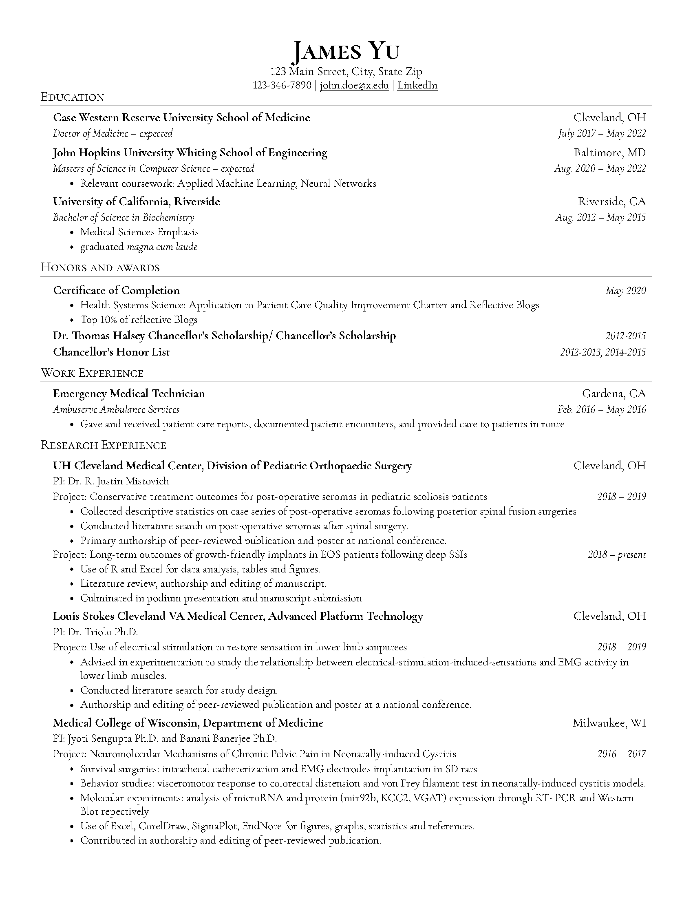
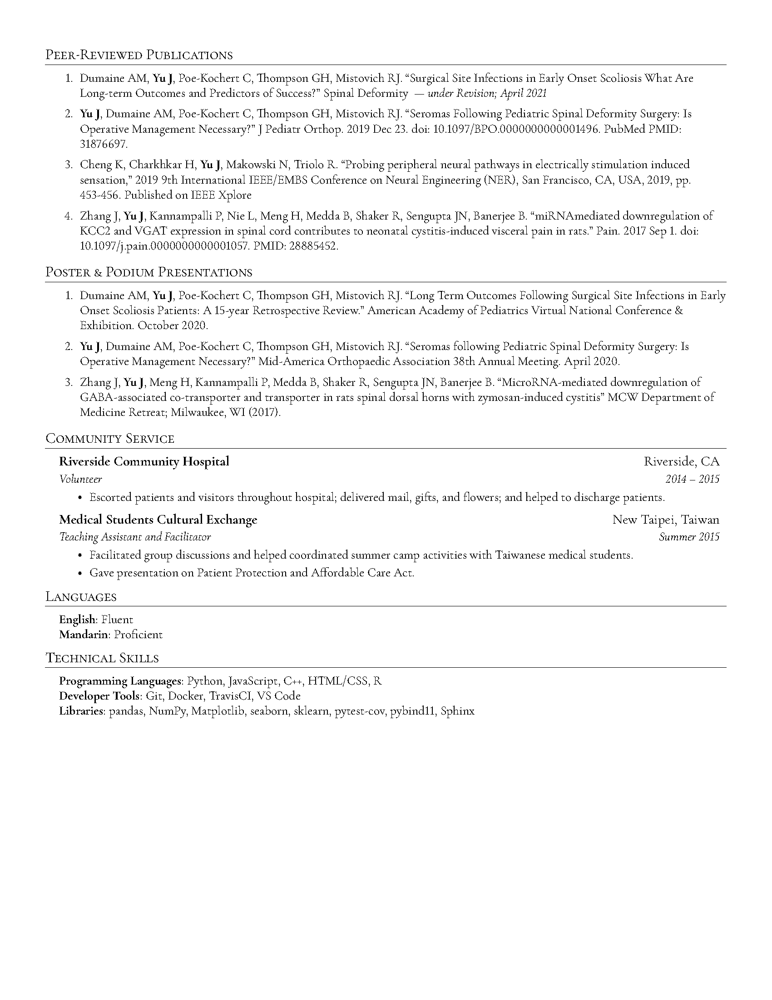

# curriculum-vitae
LaTeX template for simplified editing of a clean, well-formatted curriculum vitae

Based off of [jakegut/resume](https://github.com/jakegut/resume) and [sb2nov/resume](https://github.com/sb2nov/resume)

## Example

