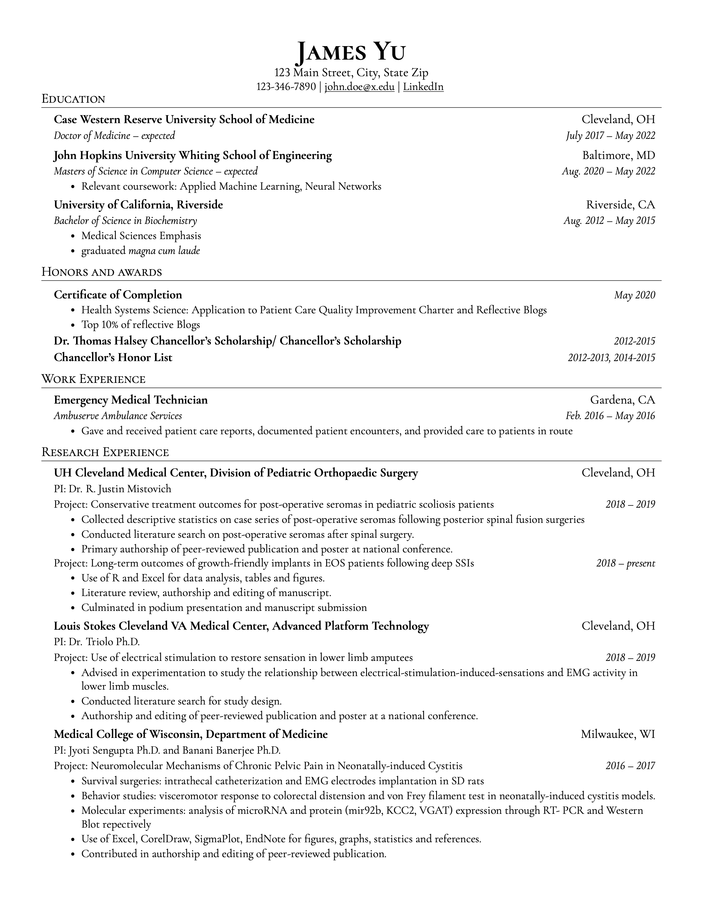
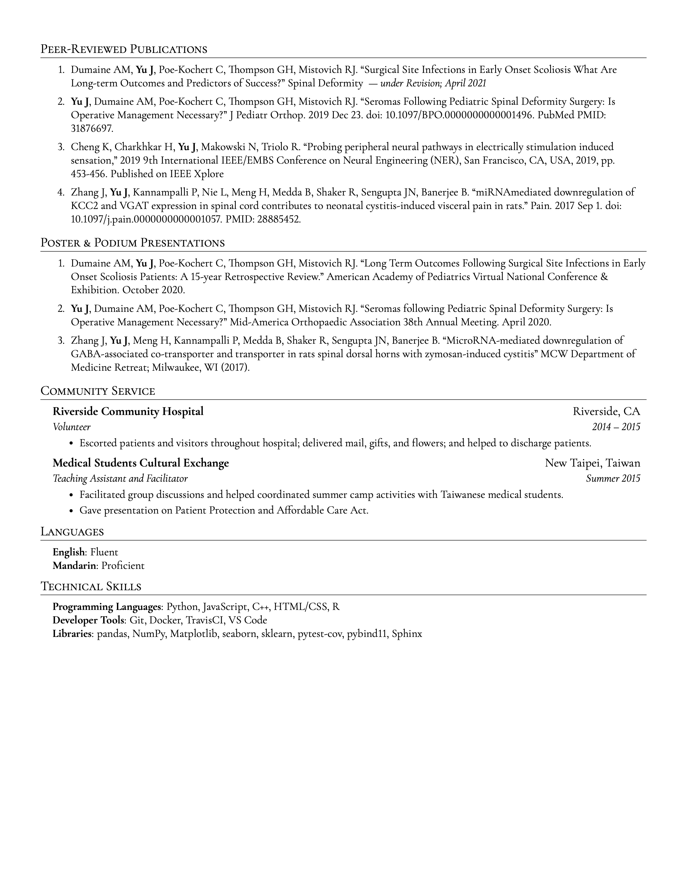

# curriculum-vitae
LaTeX template for simplified editing of a clean, well-formatted curriculum vitae. (LaTeX allows for precise typesetting and simplifies real-time updating.) 

The motivation behind this was an apparent lack of professional-appearing CV templates and to extend the options of headings and subheadings of resume templates. 
Based off of [jakegut/resume](https://github.com/jakegut/resume) and [sb2nov/resume](https://github.com/sb2nov/resume)

## Example

